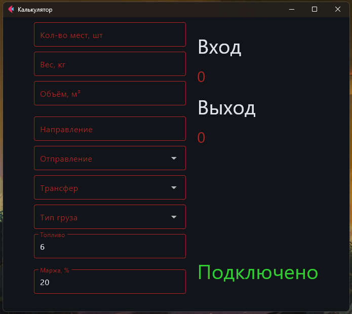

# Калькулятор коммерческих предложений

Этот проект представляет собой приложение для расчёта стоимости коммерческого предложения. Расчёт производится на основе введённых данных и динамически изменяемых тарифов из Google Sheets.

## Технологии
- Python (Flet)
- Google Sheets API

## Использование
После успешного подключения к Google Sheets результат будет автоматически выводится после введения необходимых данных.

## Интерфейс
